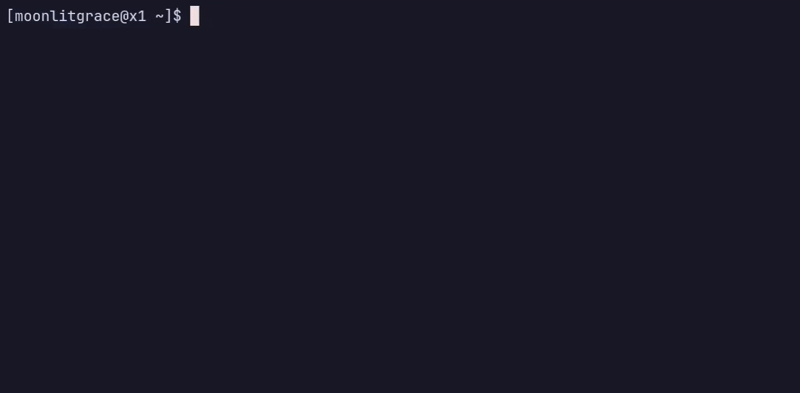

# `torrra`

> A Python tool that lets you find and download torrents without leaving your CLI.




## Features

- Search torrents from multiple indexers (`YTS` supported; more coming)
- Fetch magnet links directly
- Download torrents via libtorrent
- Pretty CLI with Rich-powered progress bars
- Modular and easily extensible indexer architecture

## Installation

Requirements: Python 3.13+ and [libtorrent](https://libtorrent.org/).

```bash
pipx install torrra
```

> Works on all platforms using the pip-installed libtorrent.

For local development:

```bash
git clone https://github.com/yourusername/torrra
cd torrra
# or use requirements.txt
uv sync
uv run torrra
```

## Indexer Support

Currently supported:

- YTS (movies)
- MagnetDL
- Movierulz (movies)

Planned:

- 1337x
- GLodls
- Nyaa (anime-only, optional)
- Community-driven additions

## Dev Notes

- Modular indexer structure (`torrra/indexers`)
- Extend `BaseIndexer` to add new sources
- Built using:
  - `httpx` + `selectolax` for scraping
  - `libtorrent` for torrenting
  - `rich` for CLI visuals
  - `questionary` for input prompts

## Contributing & Notes

This project is a weekend-hacker side project- built for fun and learning. It's not a polished product (yet), but it works well enough for daily use!

If you run into any bugs, have suggestions, or want to help improve it, feel free to [open an issue](https://github.com/stabldev/torrra/issues) or even send a pull request. All contributions are welcome.

## License

MIT. Copyright (c) [stabldev](https://github.com/stabldev)
